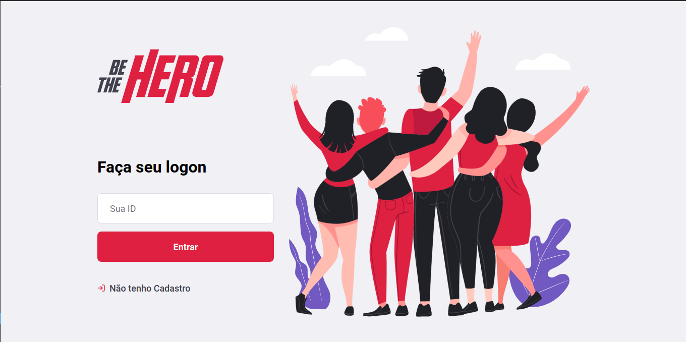
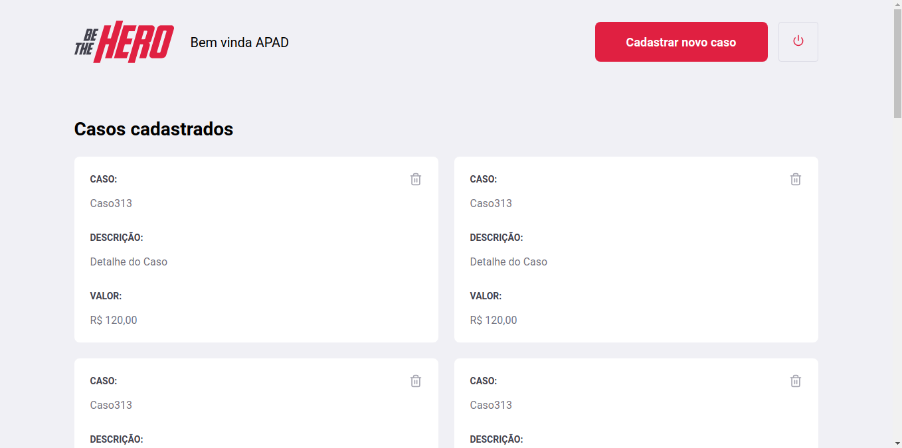
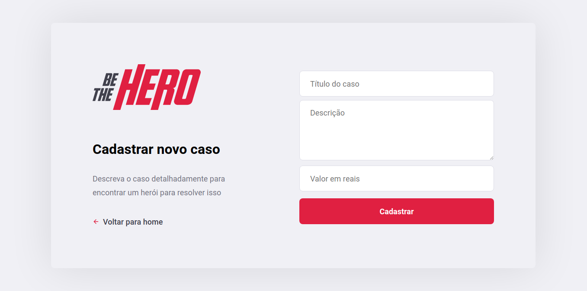
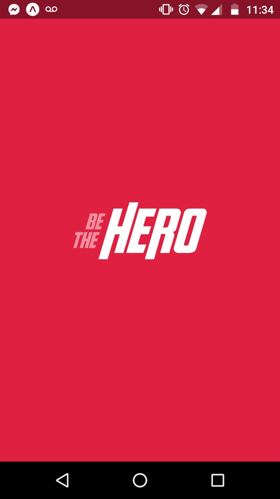
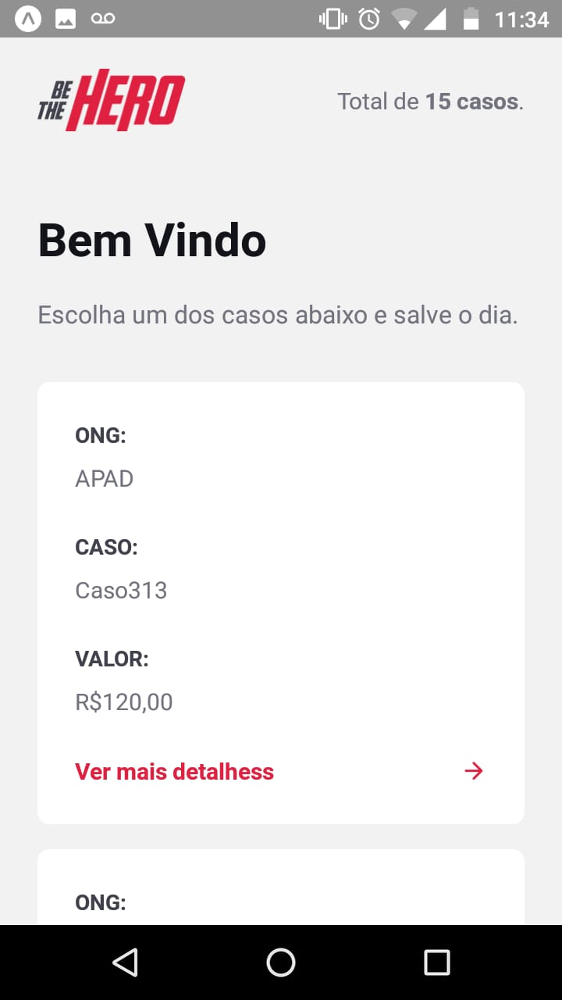
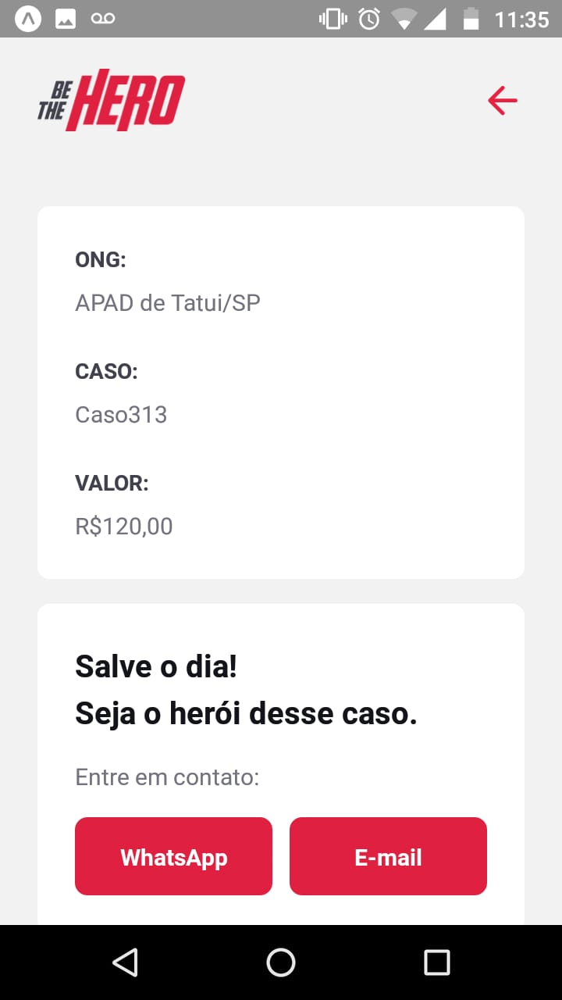

# Be The Hero

### Aplicativo desenvolvido durante a semana Omnistack 11.0

#### Um exemplo de projeto para ONGs de proteção para os animais

##### Aplicativo desenvolvido em NodeJs no backend, React para web e ReactNative para mobile

##### Screenshots Web

##### Tela login

 

##### Tela Profile

 

##### Tela Cadastro de Casos

 

##### Screenshots Mobile

##### Splash Screen

 

##### Tela Home

 

##### Tela Detalhe e Contato

